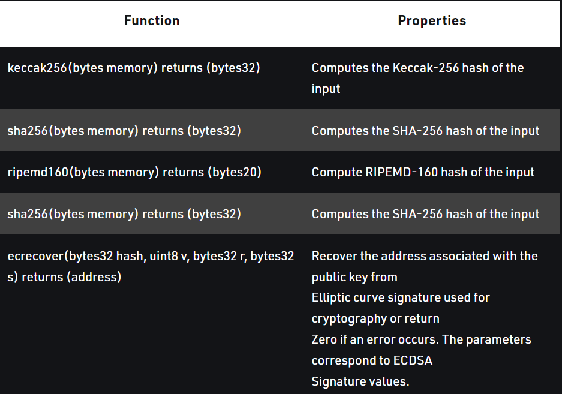

# Hashing in Solidity

A cryptographic hash function is an algorithm that takes an arbitrary amount of data as input and produces the enciphered text of fixed size. 
Even a slight change in the input gives a completely different output.

Solidity provides the following cryptographic functions:

Ethereum uses Keccak for hashing which is similar but not the same as SHA_256. For proof of work, it uses a custom scheme called ethash which is designed to be ASIC-resistant.
