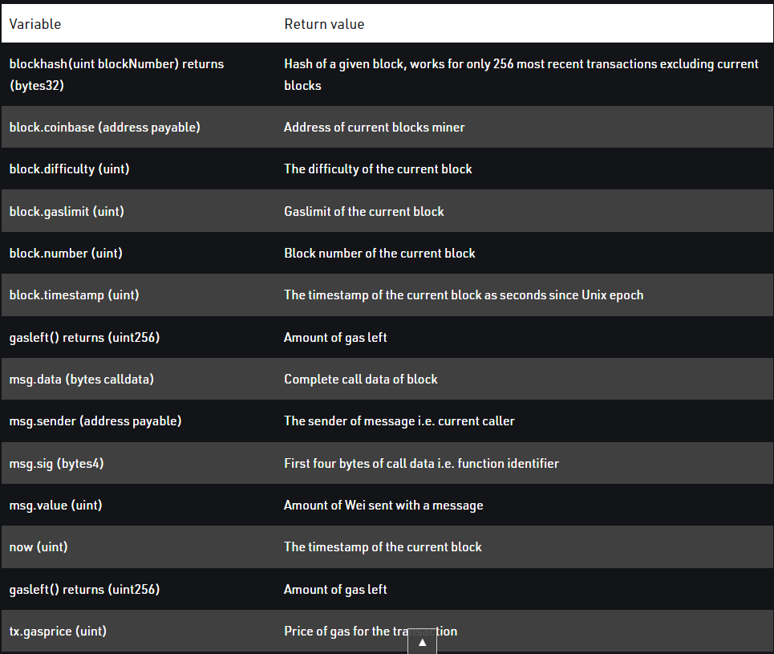

# Smart-Contracts
Solidity smart contracts

# Solidity

## Constructors

Syntax:
constructor() <Access Modifier> {          
} 

# While, Do-While, and For Loop

Syntax:
while (condition) {
    statement or block of code to be executed if the condition is True
}

## Variables 

Syntax:
<type> <access modifier> <variable name> ; 

## Operators

## Arrays

## Mappings

## Enums

## Struct
